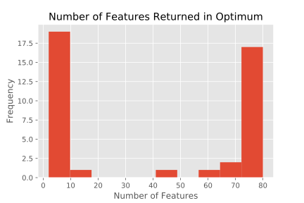
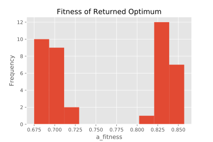
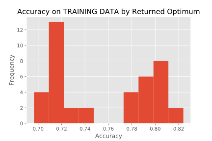
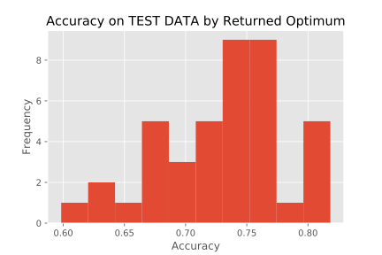
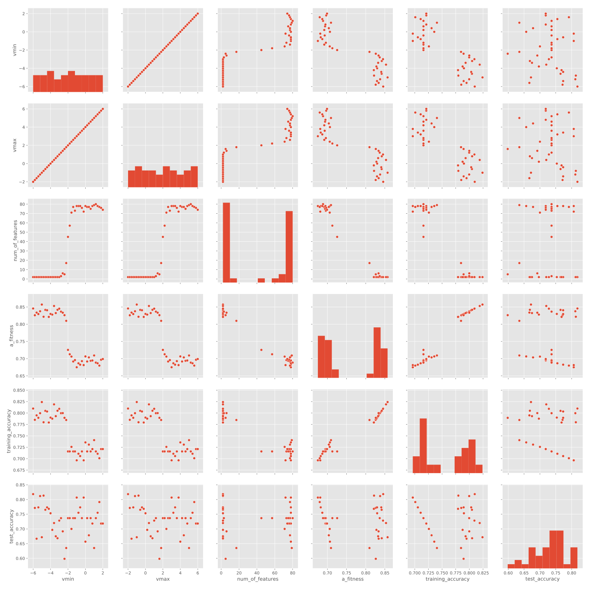
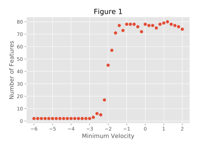
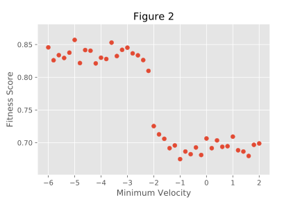
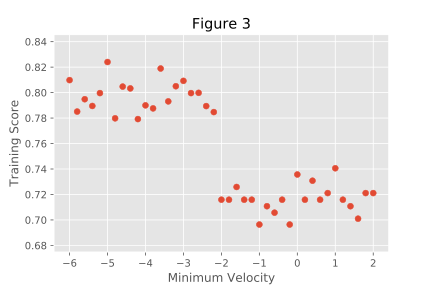
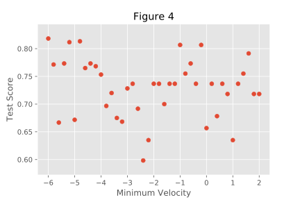

# Computing for Structure - Summer 2018 Lab Notebook
**Author:** Nathan Fox

**Date:** June 15, 2018 - ???

**Supervisors:** Vance Lemmon, Stefan Wuchty

## Table of Contents
Experiment|Date|Summary|Completed
:---------|----|:------|---------
[Tuning VBounds](#0001)|06/15/2018|Testing COMB-PSO on kinase inhibitor data with varying vbounds.|No

----------------------------------------------------------------------------------------------------

## Tuning VBounds <a name="0001"></a>
**Date:** June 15, 2018

### Question
How does changing the vbounds parameter in the COMB-PSO algorithm on the kinase inhibitor data
I was given change the accuracy and efficiency of the the algorithm?

### Hypothesis
Based on what Hassen Dhrif (author of COMB-PSO) told me in discussion, it seems likely that
changing the vbounds parameter might improve overfitting. I personally think it will also
impact the ability of the swarm to effectively explore the search space.

Hassen tells me that a vbounds like [-4.0, 0.25] helps the swarm prioritize higher accuracy
and fewer features. However, I don't understand why an asymmetrical (around 0) bounds
parameter will help that. It seems to me like it will just concentrate the swarm in a subset
of the search space. Analogy, if the search space was the cartesian plane where x ϵ [-10, 10]
and y ϵ [-10, 10] and the search space was centered on the origin, then an asymmetrical
velocity vector would result in heavy exploration of quadrant III over quadrant I. How do I
know that the search space is centered on (0, 0, ... , 0)?

### Experiment Design
I decided to keep a constant vbounds range and only move it. Essentially, I'm varying
the vbounds\_center while keeping vbounds\_range constant. I'm varying vbounds from
(-6.0, -2.0) to (2.0, 6.0) in increments of 0.2, i.e. {(-6.0, -2.0), (-5.8, -1.8), ... ,
(1.8, 5.8), (2.0, 6.0)}. For each of these, I am running a full COMB-PSO algorithm
over the kinase inhibitor data, attempting to identify features (kinases) that are
needed to correctly classify kinase inhibitors as {hit|non-hit}. 

#### Parameters
Number of Particles (npart)|100
Number of Features (ndim)|190
Acceleration Constants (c1, c2, c3)|2.1, 2.1, 2.1
Alpha (alpha)|0.8
Test Size (testsize)|0.2
X Bounds (x\_bounds)|(-6.0, 6.0)
V Bounds (v\_bounds)|INDEPENDENT VARIABLE
W Bounds (w\_bounds|(0.4, 0.9)
Time (t\_bounds[1])|300

#### Input
**Feature Data:** data/data.csv

**Target Data:** data/target.csv

**Feature Labels:** data/feature\_labels.csv

#### Output

Each iteration creates a directory called XX\_vbounds\_vv\_VV/ where XX = the iteration number,
vv = v minimum, and VV = v maximum. Inside each directory is a file list:

* abinary.csv
* cpso\_script.py
* error.txt
* output.txt
* job\_script
* pickled\_trained\_classifier
* summary\_results.out
* var\_by\_time.csv
* X\_train.csv
* y\_train.csv
* X\_test.csv
* y\_test.csv

pickled\_trained\_classifier and all \*.csv files are variable outputs at the end of the
algorithm. summary\_results.out is a comprehensive, auto-generated report. error.txt and
output.txt are stderr and stdout for the job. cpso\_script.py and job\_script are the
scripts used to run this experiment.

#### Running the Experiment

File List:

* cpso\_particle.py
* cpso\_swarm.py
* cpso.py
* experiment\_script.py
* data\_extracter.sh

Directory List:

* analysis/
* data/

cpso\_particle.py and cpso\_swarm.py respectively hold COMB\_Particle and COMB\_Swarm classes
used by cpso.py to run an experiment. The actual experiment code is called by job\_script
for each iteration from within experiment\_script.py which generates and runs all jobs.
data\_extracter.sh is a bash script that iterates over all summary\_report.out files and
extracts the important information to analysis/raw\_data.csv.

This experiment was run with a series of dynamically created/called jobs on the Pegasus
supercomputer at the Center for Computational Sciences at the University of Miami by
user ncf30 in project reu. Output emails are dumped in the LSF-Pegasus folder in
\<nathanfox@miami.edu\>.

#### experiment\_script.py
```
import os
import numpy as np

project = 'reu'
queue = 'general'
runtime = '1:00'
processors = '1'
email = 'nathanfox@miami.edu'

counter = 0
for vmin in np.arange(-6.0, 2.1, 0.2):
    vmax = vmin + 4.0
    filename = '{:02}_vbounds_{:+.1f}_{:+.1f}'.format(counter, vmin, vmax)
    os.system('mkdir {}'.format(filename))
    with open(filename+'/job_script', 'w') as f:
        f.write('#!/bin/bash\n')
        f.write('#BSUB -J {}\n'.format(filename))
        f.write('#BSUB -P {}\n'.format(project))
        f.write('#BSUB -o {}/output.txt\n'.format(filename))
        f.write('#BSUB -e {}/error.txt\n'.format(filename))
        f.write('#BSUB -W {}\n'.format(runtime))
        f.write('#BSUB -q {}\n'.format(queue))
        f.write('#BSUB -n {}\n'.format(processors))
        f.write('#BSUB -B\n')
        f.write('#BSUB -N\n')
        f.write('#BSUB -u {}\n'.format(email))
        f.write('\n')
        f.write('python cpso.py --npart 100 --ndim 190 --constants 2.1 2.1 2.1 '
              + '--alpha 0.8 --testsize 0.2 --xbounds -6.0 6.0 '
              + '--vbounds {:.1f} {:.1f} '.format(vmin, vmax)
              + '--wbounds 0.4 0.9 --time 300 --data data/data.csv '
              + '--target data/target.csv --labels data/feature_labels.csv '
              + '--expname "Tuning Velocity Bounds: v_bounds = '
              + '({:.1f}, {:.1f})" '.format(vmin, vmax)
              + '--author "Nathan Fox" --outpath {}/ '.format(filename)
	      + '--copyscript\n')
    os.system('bsub < {}/job_script'.format(filename))
    counter += 1
```

### Results

#### Descriptive Statistics
|       | num\_of\_features | a\_fitness          | training\_accuracy  | test\_accuracy     | 
|-------|-------------------|---------------------|---------------------|--------------------| 
| count | 41.0              | 41.0                | 41.0                | 41.0               | 
| mean  | 39.4390243902439  | 0.7632048780487803  | 0.7558951219512198  | 0.7303146341463412 | 
| std   | 36.39783563653738 | 0.07145365613885518 | 0.04258470354023562 | 0.0526396835143203 | 
| min   | 2.0               | 0.675               | 0.6964              | 0.5983             | 
| 25%   | 2.0               | 0.6938              | 0.7159              | 0.6967             | 
| 50%   | 45.0              | 0.7254              | 0.7406              | 0.7367             | 
| 75%   | 77.0              | 0.8335              | 0.7948              | 0.7683             | 
| max   | 80.0              | 0.8571              | 0.824               | 0.8183             | 

#### Plots
##### Histograms of Numerical Dependent Variables






##### Pair Plot of all Relevant Variables


##### Scatter Plots of Interest






The two most important plots are Figures 1 and 4. There is an extremely strong sigmoid relationship
between the location of vbounds (the center) and the number of features included in the final
result. I'm not sure why, maybe an artifact of the logistic function used in the continuous to
binary position converstion? This is probably what Hassen was talking about when he said that
a vbounds skewed on the negative side helped reduce the number of features selected. However, this
is somewhat riduculous, it only gives two options. Additionally, there is no apparent relationship
between the location of the vbounds center and the resulting TEST accuracy.

Something else to note, the sigmoid relationship in Figure 1 appears to be bleeding into Figures
2 and 3. Apparently, the number of features has an impact on a\_fitness and training accuracy.
The impact on a\_fitness is expected (the fitness function included a weight on number
of features where fewer is better), but I'm surprised that it stratified the testing accuracy.
Perhaps this is because the fitness function is used to determine velocity?
