# Computing for Structure - Summer 2018 Lab Notebook
**Author:** Nathan Fox

**Date:** June 15, 2018 - ???

**Supervisors:** Vance Lemmon, Stefan Wuchty

## Table of Contents <a name="0000"></a>
Experiment|Date|Summary|Completed
:---------|----|:------|---------
[Tuning VBounds](#0001)|06/15/2018|Testing COMB-PSO on kinase inhibitor data with varying vbounds.|Yes
[Tuning VBounds - Range](#0002)|06/16/2018|Testing COMB-PSO on kinase inhibitor data with a varying vbound range.|Yes
[Conceptual Brainstorming](#1001)|06/18/2018|Brainstorming and contemplating about the last two experiments.|Yes
[Polypharm Linkage Hypothesis](#1002)|06/19/2018|Hypothesis about polypharmacologically linked kinases and the results from COMB-PSO.|Yes
[Even Split Check](#1003)|06/19/2018|Checking to see if Hit/Non-Hit ratio is consistent with training/test splits.|Yes
[Mean Particle Velocity](#0003)|06/26/2018|Characterizing particle velocities.|Yes
[Mean Particle Velocity - The Sequel](#0004)|06/26/2018|Redoing the original Mean Particle Velocity Experiment with a better assay.|Yes
[Swarm Convergence](#0005)|06/27/2018|Checking for convergence over time|Yes
[Verifying Rational Polypharmacology](#0006)|07/3/2018|Running an SVM on the returned informative kinases from the "Rational Polypharmacology" paper.|No

----------------------------------------------------------------------------------------------------

## Tuning VBounds <a name="0001"></a>
June 15, 2018

### Question
How does changing the vbounds parameter in the COMB-PSO algorithm on the kinase inhibitor data
I was given change the accuracy and efficiency of the the algorithm?

### Hypothesis
Based on what Hassen Dhrif (author of COMB-PSO) told me in discussion, it seems likely that
changing the vbounds parameter might improve overfitting. I personally think it will also
impact the ability of the swarm to effectively explore the search space.

Hassen tells me that a vbounds like [-4.0, 0.25] helps the swarm prioritize higher accuracy
and fewer features. However, I don't understand why an asymmetrical (around 0) bounds
parameter will help that. It seems to me like it will just concentrate the swarm in a subset
of the search space. Analogy, if the search space was the cartesian plane where x ϵ [-10, 10]
and y ϵ [-10, 10] and the search space was centered on the origin, then an asymmetrical
velocity vector would result in heavy exploration of quadrant III over quadrant I. How do I
know that the search space is centered on (0, 0, ... , 0)?

### Experiment Design
I decided to keep a constant vbounds range and only move it. Essentially, I'm varying
the vbounds\_center while keeping vbounds\_range constant. I'm varying vbounds from
(-6.0, -2.0) to (2.0, 6.0) in increments of 0.2, i.e. {(-6.0, -2.0), (-5.8, -1.8), ... ,
(1.8, 5.8), (2.0, 6.0)}. For each of these, I am running a full COMB-PSO algorithm
over the kinase inhibitor data, attempting to identify features (kinases) that are
needed to correctly classify kinase inhibitors as {hit|non-hit}. 

Parameter|Value
:--------|-----
Number of Particles (npart)|100
Number of Features (ndim)|190
Acceleration Constants (c1, c2, c3)|2.1, 2.1, 2.1
Alpha (alpha)|0.8
Test Size (testsize)|0.2
X Bounds (x\_bounds)|(-6.0, 6.0)
V Bounds (v\_bounds)|INDEPENDENT VARIABLE
W Bounds (w\_bounds|(0.4, 0.9)
Time (t\_bounds[1])|300

#### Input
Feature Data: data/data.csv

Target Data: data/target.csv

Feature Labels: data/feature\_labels.csv

#### Output

Each iteration creates a directory called XX\_vbounds\_vv\_VV/ where XX = the iteration number,
vv = v minimum, and VV = v maximum. Inside each directory is a file list:

* abinary.csv
* cpso\_script.py
* error.txt
* output.txt
* job\_script
* pickled\_trained\_classifier
* summary\_results.out
* var\_by\_time.csv
* X\_train.csv
* y\_train.csv
* X\_test.csv
* y\_test.csv

pickled\_trained\_classifier and all \*.csv files are variable outputs at the end of the
algorithm. summary\_results.out is a comprehensive, auto-generated report. error.txt and
output.txt are stderr and stdout for the job. cpso\_script.py and job\_script are the
scripts used to run this experiment.

#### Running the Experiment

File List:

* cpso\_particle.py
* cpso\_swarm.py
* cpso.py
* experiment\_script.py
* data\_extracter.sh

Directory List:

* analysis/
* data/

cpso\_particle.py and cpso\_swarm.py respectively hold COMB\_Particle and COMB\_Swarm classes
used by cpso.py to run an experiment. The actual experiment code is called by job\_script
for each iteration from within experiment\_script.py which generates and runs all jobs.
data\_extracter.sh is a bash script that iterates over all summary\_report.out files and
extracts the important information. I then pipe the output to analysis/raw\_data.csv.

data/ holds the three data input files for the experiment. analysis/ holds anything processed
after the experiment was run: processed data, analysis notebooks, generated figures, etc.

This experiment was run with a series of dynamically created/called jobs on the Pegasus
supercomputer at the Center for Computational Sciences at the University of Miami by
user ncf30 in project reu. Output emails are dumped in the LSF-Pegasus folder in
\<nathanfox@miami.edu\>.

#### experiment\_script.py
```
import os
import numpy as np

project = 'reu'
queue = 'general'
runtime = '1:00'
processors = '1'
email = 'nathanfox@miami.edu'

counter = 0
for vmin in np.arange(-6.0, 2.1, 0.2):
    vmax = vmin + 4.0
    filename = '{:02}_vbounds_{:+.1f}_{:+.1f}'.format(counter, vmin, vmax)
    os.system('mkdir {}'.format(filename))
    with open(filename+'/job_script', 'w') as f:
        f.write('#!/bin/bash\n')
        f.write('#BSUB -J {}\n'.format(filename))
        f.write('#BSUB -P {}\n'.format(project))
        f.write('#BSUB -o {}/output.txt\n'.format(filename))
        f.write('#BSUB -e {}/error.txt\n'.format(filename))
        f.write('#BSUB -W {}\n'.format(runtime))
        f.write('#BSUB -q {}\n'.format(queue))
        f.write('#BSUB -n {}\n'.format(processors))
        f.write('#BSUB -B\n')
        f.write('#BSUB -N\n')
        f.write('#BSUB -u {}\n'.format(email))
        f.write('\n')
        f.write('python cpso.py --npart 100 --ndim 190 --constants 2.1 2.1 2.1 '
              + '--alpha 0.8 --testsize 0.2 --xbounds -6.0 6.0 '
              + '--vbounds {:.1f} {:.1f} '.format(vmin, vmax)
              + '--wbounds 0.4 0.9 --time 300 --data data/data.csv '
              + '--target data/target.csv --labels data/feature_labels.csv '
              + '--expname "Tuning Velocity Bounds: v_bounds = '
              + '({:.1f}, {:.1f})" '.format(vmin, vmax)
              + '--author "Nathan Fox" --outpath {}/ '.format(filename)
	      + '--copyscript\n')
    os.system('bsub < {}/job_script'.format(filename))
    counter += 1
```

### Results/Analysis

#### Descriptive Statistics
|       | num\_of\_features | a\_fitness          | training\_accuracy  | test\_accuracy     | 
|-------|-------------------|---------------------|---------------------|--------------------| 
| count | 41.0              | 41.0                | 41.0                | 41.0               | 
| mean  | 39.4390243902439  | 0.7632048780487803  | 0.7558951219512198  | 0.7303146341463412 | 
| std   | 36.39783563653738 | 0.07145365613885518 | 0.04258470354023562 | 0.0526396835143203 | 
| min   | 2.0               | 0.675               | 0.6964              | 0.5983             | 
| 25%   | 2.0               | 0.6938              | 0.7159              | 0.6967             | 
| 50%   | 45.0              | 0.7254              | 0.7406              | 0.7367             | 
| 75%   | 77.0              | 0.8335              | 0.7948              | 0.7683             | 
| max   | 80.0              | 0.8571              | 0.824               | 0.8183             | 

#### Plots
##### Histograms of Numerical Dependent Variables


##### Pair Plot of all Relevant Variables


##### Scatter Plots of Interest


The two most important plots are Figures 1 and 4. There is an extremely strong sigmoid relationship
between the location of vbounds (the center) and the number of features included in the final
result. I'm not sure why, maybe an artifact of the logistic function used in the continuous to
binary position converstion? This is probably what Hassen was talking about when he said that
a vbounds skewed on the negative side helped reduce the number of features selected. However, this
is somewhat riduculous, it only gives two options. Additionally, there is no apparent relationship
between the location of the vbounds center and the resulting TEST accuracy.

Something else to note, the sigmoid relationship in Figure 1 appears to be bleeding into Figures
2 and 3. Apparently, the number of features has an impact on a\_fitness and training accuracy.
The impact on a\_fitness is expected (the fitness function included a weight on number
of features where fewer is better), but I'm surprised that it stratified the testing accuracy.
Perhaps this is because the fitness function is used to determine velocity?

### Conclusions/Next Questions
Disappointingly, I saw no relationship between a moving window for vbounds and the ultimate
accuracy of the classifier on the test data. Surprisingly, I saw a strong sigmoid relationship
between the value for vbounds and the number of features in the returned optimum subset.
The logistic function is used to convert a continuous position vector into a binary position
vector. I wonder if this is an artifact of that function. It seems extremely inconvenient.
With the rest of the parameters, moving vbounds causes the algorithm to shift between
two drastically different values. Additionally, this appears to bleed into the results of
the classification accuracy on TRAINING data.

Next questions include whether or not I can tune the y offset of the sigmoid relationship
between vmin and number of features, or if necessary how to ameliorate it.

[Return to top](#0000)

----------------------------------------------------------------------------------------------------

## Tuning VBounds - Range <a name="0002"></a>
June 16, 2018

### Question
How does change the size of the range of vbounds alter the accuracy of the classifier using the
returned subset? How does it affect other dependent variables like the fitness or number of
features selected? In addition, does the placement of the center change the effect of the
changing range?

### Hypothesis
Based on my previous experiment, [Tuning VBounds](#0001), I think that the placement of the center
will matter a great deal. I think that each set will have its own range of results. However, I
am not sure if it will affect the *relationship* that vrange has on the results. I hypothesize
that a larger range will return generally higher TRAINING scores, because a small velocity
prohibits exploration and limits the particles to exploitation behavior. Additionally, I
hypothesize that a small range limited to > 0 or < 0 will produce unusual results.

### Experiment Design
This experiment is divided into 5 cohorts, where each cohort has a different vbounds center.
For example, if vbounds = (-6.0, -2.0), the center = -4.0. I chose centers at {-4.0, -2.0,
0.0, 2.0, 4.0}. For each cohort, I varied the range of vbounds from 0.0 to 8.0, or +/- 0.0
to +/- 4.0. For each vbounds in each cohort, I ran a COMB-PSO algorithm to produce results.

I will examine the number of features returned, the fitness score, and the TRAINING/TEST
scores for the returned subset, based on both the center of the vbounds and the range
of the vbounds.

Parameter|Value
:--------|-----
Number of Particles (npart)|100
Number of Features (ndim)|190
Acceleration Constants (c1, c2, c3)|2.1, 2.1, 2.1
Alpha (alpha)|0.8
Test Size (testsize)|0.2
X Bounds (x\_bounds)|(-6.0, 6.0)
V Bounds (v\_bounds)|INDEPENDENT VARIABLE
V Range (v\_bounds[1] - v\_bounds[0])| INDEPENDENT VARIABLE
W Bounds (w\_bounds|(0.4, 0.9)
Time (t\_bounds[1])|300

#### Input
For each cohort...

* Feature Data: data/data.csv
* Target Data: data/target.csv
* Feature Labels: data/feature\_labels.csv

#### Output
Each cohort is contained in a separate directory inside the experiment directory. For each
cohort...

Each iteration creates a directory called XX\_vcenter\_VV\_vrange\_RR/ where XX = the
iteration number, VV = vcenter, and RR = vrange. Inside each directory is a file list:

* abinary.csv
* cpso\_script.py
* error.txt
* output.txt
* job\_script
* pickled\_trained\_classifier
* summary\_results.out
* var\_by\_time.csv
* X\_train.csv
* y\_train.csv
* X\_test.csv
* y\_test.csv

pickled\_trained\_classifier and all \*.csv files are variable outputs at the end of the
algorithm. summary\_results.out is a comprehensive, auto-generated report. error.txt and
output.txt are stderr and stdout for the job. cpso\_script.py and job\_script are the
scripts used to run this experiment.

#### Running the Experiment
For each cohort...

File List:

* cpso\_particle.py
* cpso\_swarm.py
* cpso.py
* experiment\_script.py
* data\_extracter.sh

Directory List:

* analysis/
* data/

cpso\_particle.py and cpso\_swarm.py respectively hold COMB\_Particle and COMB\_Swarm classes
used by cpso.py to run an experiment. The actual experiment code is called by job\_script
for each iteration from within experiment\_script.py which generates and runs all jobs.
data\_extracter.sh is a bash script that iterates over all summary\_report.out files and
extracts the important information. I then pipe the output to analysis/raw\_data.csv.

data/ holds the three data input files for the experiment. analysis/ holds anything processed
after the experiment was run: processed data, analysis notebooks, generated figures, etc.

This experiment was run with a series of dynamically created/called jobs on the Pegasus
supercomputer at the Center for Computational Sciences at the University of Miami by
user ncf30 in project reu. Output emails are dumped in the LSF-Pegasus folder in
\<nathanfox@miami.edu\>.


#### experiment\_script.py for Each Cohort
Center = -4.0
```
import os
import numpy as np

project = 'reu'
queue = 'general'
runtime = '2:00'
processors = '1'
email = 'nathanfox@miami.edu'

counter = 0
vcenter = -4.0
for vhalfrange in np.arange(0.0, 4.0, 0.2):
    vmax = vcenter + vhalfrange
    vmin = vcenter - vhalfrange
    filename = '{:02}_vcenter_-4.0_vrange_{:+.1f}'.format(counter, 2*vhalfrange)
    os.system('mkdir {}'.format(filename))
    with open(filename+'/job_script', 'w') as f:
        f.write('#!/bin/bash\n')
        f.write('#BSUB -J {}\n'.format(filename))
        f.write('#BSUB -P {}\n'.format(project))
        f.write('#BSUB -o {}/output.txt\n'.format(filename))
        f.write('#BSUB -e {}/error.txt\n'.format(filename))
        f.write('#BSUB -W {}\n'.format(runtime))
        f.write('#BSUB -q {}\n'.format(queue))
        f.write('#BSUB -n {}\n'.format(processors))
        f.write('#BSUB -B\n')
        f.write('#BSUB -N\n')
        f.write('#BSUB -u {}\n'.format(email))
        f.write('\n')
        f.write('python cpso.py --npart 100 --ndim 190 --constants 2.1 2.1 2.1 '
              + '--alpha 0.8 --testsize 0.2 --xbounds -6.0 6.0 '
              + '--vbounds {:.1f} {:.1f} '.format(vmin, vmax)
              + '--wbounds 0.4 0.9 --time 300 --data data/data.csv '
              + '--target data/target.csv --labels data/feature_labels.csv '
              + '--expname "Tuning Velocity Bounds: v_bounds = '
              + '({:.1f}, {:.1f})" '.format(vmin, vmax)
              + '--author "Nathan Fox" --outpath {}/ '.format(filename)
	      + '--copyscript\n')
    os.system('bsub < {}/job_script'.format(filename))
    counter += 1
```

Center = -2.0
```
import os
import numpy as np

project = 'reu'
queue = 'general'
runtime = '2:00'
processors = '1'
email = 'nathanfox@miami.edu'

counter = 0
vcenter = -2.0
for vhalfrange in np.arange(0.0, 4.0, 0.2):
    vmax = vcenter + vhalfrange
    vmin = vcenter - vhalfrange
    filename = '{:02}_vcenter_-2.0_vrange_{:+.1f}'.format(counter, 2*vhalfrange)
    os.system('mkdir {}'.format(filename))
    with open(filename+'/job_script', 'w') as f:
        f.write('#!/bin/bash\n')
        f.write('#BSUB -J {}\n'.format(filename))
        f.write('#BSUB -P {}\n'.format(project))
        f.write('#BSUB -o {}/output.txt\n'.format(filename))
        f.write('#BSUB -e {}/error.txt\n'.format(filename))
        f.write('#BSUB -W {}\n'.format(runtime))
        f.write('#BSUB -q {}\n'.format(queue))
        f.write('#BSUB -n {}\n'.format(processors))
        f.write('#BSUB -B\n')
        f.write('#BSUB -N\n')
        f.write('#BSUB -u {}\n'.format(email))
        f.write('\n')
        f.write('python cpso.py --npart 100 --ndim 190 --constants 2.1 2.1 2.1 '
              + '--alpha 0.8 --testsize 0.2 --xbounds -6.0 6.0 '
              + '--vbounds {:.1f} {:.1f} '.format(vmin, vmax)
              + '--wbounds 0.4 0.9 --time 300 --data data/data.csv '
              + '--target data/target.csv --labels data/feature_labels.csv '
              + '--expname "Tuning Velocity Bounds: v_bounds = '
              + '({:.1f}, {:.1f})" '.format(vmin, vmax)
              + '--author "Nathan Fox" --outpath {}/ '.format(filename)
	      + '--copyscript\n')
    os.system('bsub < {}/job_script'.format(filename))
    counter += 1
```

Center = 0.0
```
import os
import numpy as np

project = 'reu'
queue = 'general'
runtime = '2:00'
processors = '1'
email = 'nathanfox@miami.edu'

counter = 0
vcenter = 0.0
for vhalfrange in np.arange(0.0, 4.0, 0.2):
    vmax = vcenter + vhalfrange
    vmin = vcenter - vhalfrange
    filename = '{:02}_vcenter_0.0_vrange_{:+.1f}'.format(counter, 2*vhalfrange)
    os.system('mkdir {}'.format(filename))
    with open(filename+'/job_script', 'w') as f:
        f.write('#!/bin/bash\n')
        f.write('#BSUB -J {}\n'.format(filename))
        f.write('#BSUB -P {}\n'.format(project))
        f.write('#BSUB -o {}/output.txt\n'.format(filename))
        f.write('#BSUB -e {}/error.txt\n'.format(filename))
        f.write('#BSUB -W {}\n'.format(runtime))
        f.write('#BSUB -q {}\n'.format(queue))
        f.write('#BSUB -n {}\n'.format(processors))
        f.write('#BSUB -B\n')
        f.write('#BSUB -N\n')
        f.write('#BSUB -u {}\n'.format(email))
        f.write('\n')
        f.write('python cpso.py --npart 100 --ndim 190 --constants 2.1 2.1 2.1 '
              + '--alpha 0.8 --testsize 0.2 --xbounds -6.0 6.0 '
              + '--vbounds {:.1f} {:.1f} '.format(vmin, vmax)
              + '--wbounds 0.4 0.9 --time 300 --data data/data.csv '
              + '--target data/target.csv --labels data/feature_labels.csv '
              + '--expname "Tuning Velocity Bounds: v_bounds = '
              + '({:.1f}, {:.1f})" '.format(vmin, vmax)
              + '--author "Nathan Fox" --outpath {}/ '.format(filename)
	      + '--copyscript\n')
    os.system('bsub < {}/job_script'.format(filename))
    counter += 1
```

Center = 2.0
```
import os
import numpy as np

project = 'reu'
queue = 'general'
runtime = '2:00'
processors = '1'
email = 'nathanfox@miami.edu'

counter = 0
vcenter = 2.0
for vhalfrange in np.arange(0.0, 4.0, 0.2):
    vmax = vcenter + vhalfrange
    vmin = vcenter - vhalfrange
    filename = '{:02}_vcenter_2.0_vrange_{:+.1f}'.format(counter, 2*vhalfrange)
    os.system('mkdir {}'.format(filename))
    with open(filename+'/job_script', 'w') as f:
        f.write('#!/bin/bash\n')
        f.write('#BSUB -J {}\n'.format(filename))
        f.write('#BSUB -P {}\n'.format(project))
        f.write('#BSUB -o {}/output.txt\n'.format(filename))
        f.write('#BSUB -e {}/error.txt\n'.format(filename))
        f.write('#BSUB -W {}\n'.format(runtime))
        f.write('#BSUB -q {}\n'.format(queue))
        f.write('#BSUB -n {}\n'.format(processors))
        f.write('#BSUB -B\n')
        f.write('#BSUB -N\n')
        f.write('#BSUB -u {}\n'.format(email))
        f.write('\n')
        f.write('python cpso.py --npart 100 --ndim 190 --constants 2.1 2.1 2.1 '
              + '--alpha 0.8 --testsize 0.2 --xbounds -6.0 6.0 '
              + '--vbounds {:.1f} {:.1f} '.format(vmin, vmax)
              + '--wbounds 0.4 0.9 --time 300 --data data/data.csv '
              + '--target data/target.csv --labels data/feature_labels.csv '
              + '--expname "Tuning Velocity Bounds: v_bounds = '
              + '({:.1f}, {:.1f})" '.format(vmin, vmax)
              + '--author "Nathan Fox" --outpath {}/ '.format(filename)
	      + '--copyscript\n')
    os.system('bsub < {}/job_script'.format(filename))
    counter += 1
```

Center = 4.0
```
import os
import numpy as np

project = 'reu'
queue = 'general'
runtime = '2:00'
processors = '1'
email = 'nathanfox@miami.edu'

counter = 0
vcenter = 4.0
for vhalfrange in np.arange(0.0, 4.0, 0.2):
    vmax = vcenter + vhalfrange
    vmin = vcenter - vhalfrange
    filename = '{:02}_vcenter_4.0_vrange_{:+.1f}'.format(counter, 2*vhalfrange)
    os.system('mkdir {}'.format(filename))
    with open(filename+'/job_script', 'w') as f:
        f.write('#!/bin/bash\n')
        f.write('#BSUB -J {}\n'.format(filename))
        f.write('#BSUB -P {}\n'.format(project))
        f.write('#BSUB -o {}/output.txt\n'.format(filename))
        f.write('#BSUB -e {}/error.txt\n'.format(filename))
        f.write('#BSUB -W {}\n'.format(runtime))
        f.write('#BSUB -q {}\n'.format(queue))
        f.write('#BSUB -n {}\n'.format(processors))
        f.write('#BSUB -B\n')
        f.write('#BSUB -N\n')
        f.write('#BSUB -u {}\n'.format(email))
        f.write('\n')
        f.write('python cpso.py --npart 100 --ndim 190 --constants 2.1 2.1 2.1 '
              + '--alpha 0.8 --testsize 0.2 --xbounds -6.0 6.0 '
              + '--vbounds {:.1f} {:.1f} '.format(vmin, vmax)
              + '--wbounds 0.4 0.9 --time 300 --data data/data.csv '
              + '--target data/target.csv --labels data/feature_labels.csv '
              + '--expname "Tuning Velocity Bounds: v_bounds = '
              + '({:.1f}, {:.1f})" '.format(vmin, vmax)
              + '--author "Nathan Fox" --outpath {}/ '.format(filename)
	      + '--copyscript\n')
    os.system('bsub < {}/job_script'.format(filename))
    counter += 1
```

### Results/Analysis
I made two mistakes in coding the experiment. I forgot that the `cpso.py` script will complain
and quit if v_bounds[1]-v_bounds[0] <= 0, so all of the vrange = 0.0 data points were useless
(1 per cohort). Additionally, in `experiment_script.py`, I forgot that the `np.linspace` method's
stop parameter is excluded. So I'm missing a data point from the end where vrange = 8.0. I don't
think that either of these mistakes invalidated my data, so I proceeded normally.

The analysis for each cohort consisted of a simple pair plot and Pearson's correlation coefficient
for the following variables: \[vrange, num\_of\_features, a\_fitness, training\_score, and
test\_score\]. To enhance readability, they can be found at the bottom of the Analysis.ipynb
notebook in the analysis/ folder for each cohort.

#### Center = -4.0

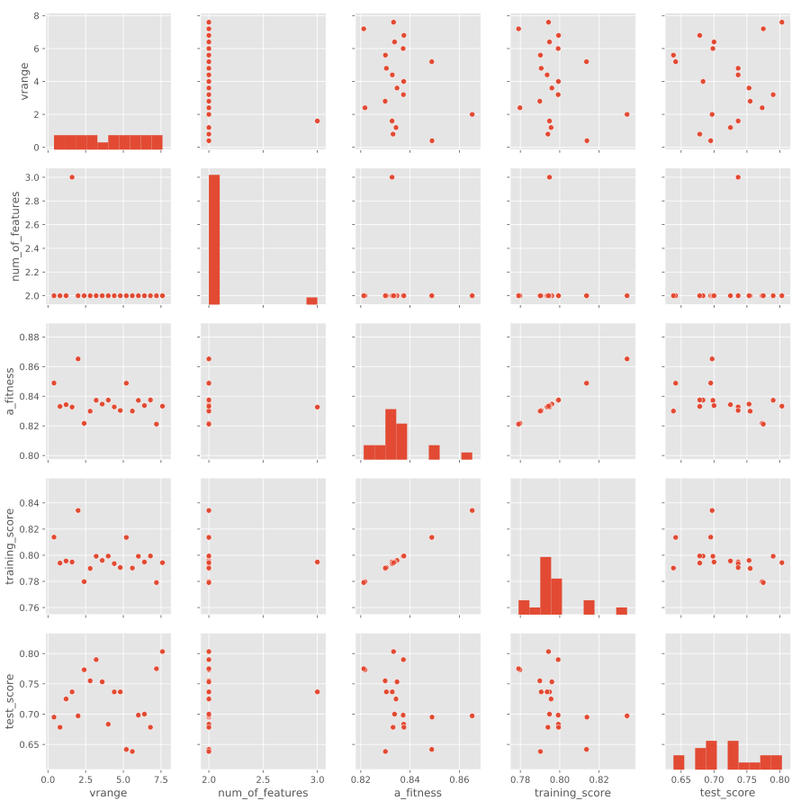
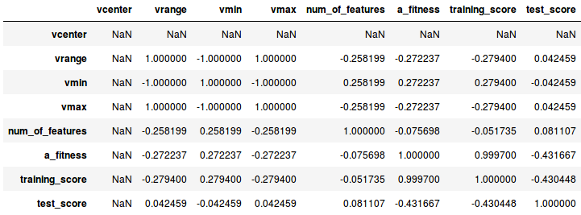

#### Center = -2.0

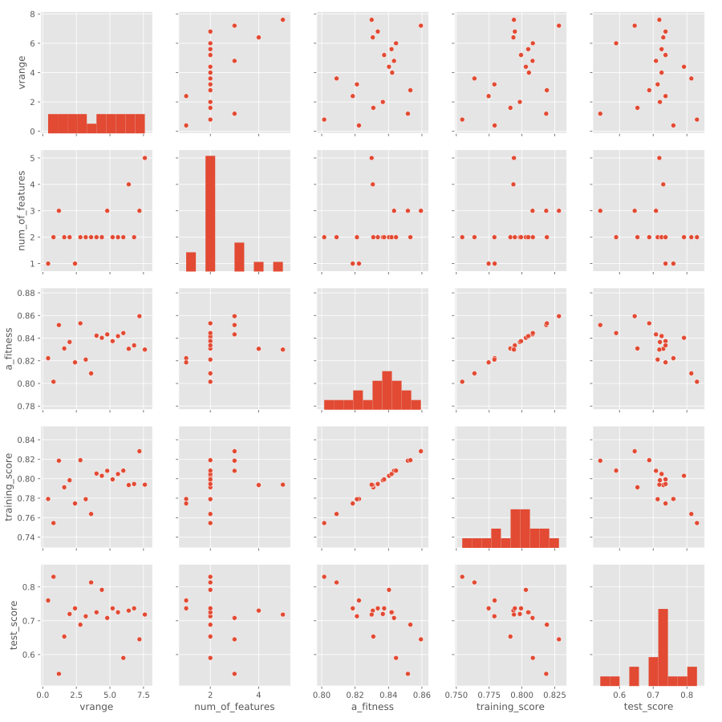
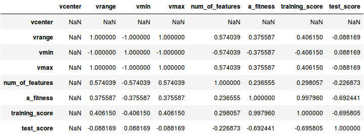

#### Center = 0.0

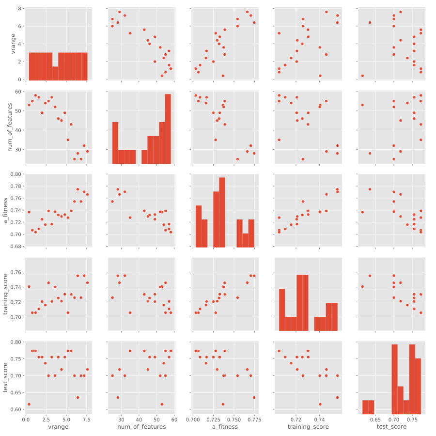
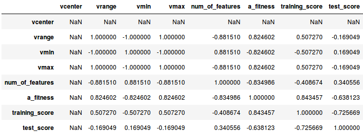

#### Center = +2.0

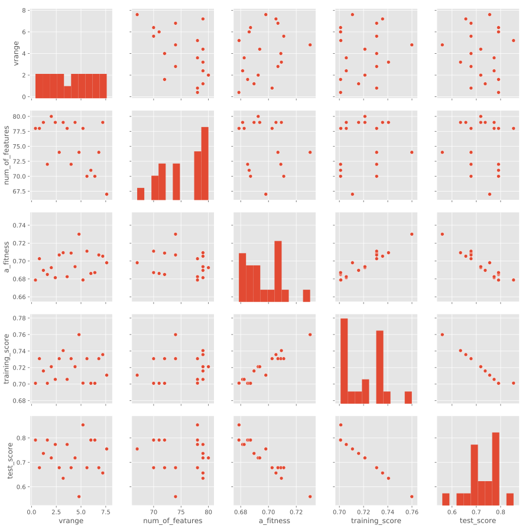
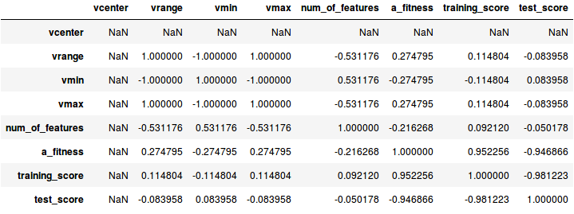

#### Center = +4.0

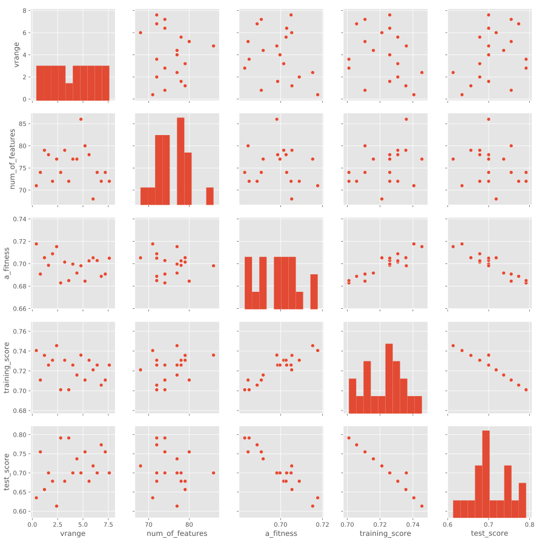
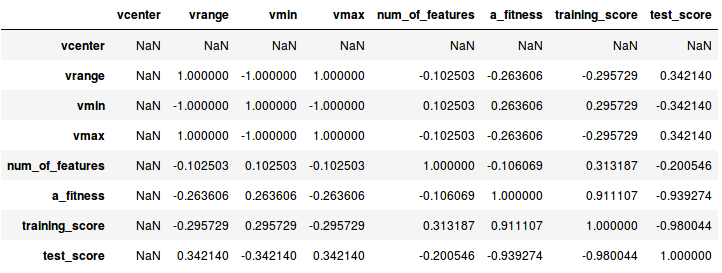

----------------------------------------------------------------------------------------------------

#### Main Observations:

1. When vcenter > 0, there is a strong negative correlation between test\_score and
   training\_score.
2. There is no correlation between vrange and test\_score, regardless of vcenter.
3. There is still an extreme relationship between vcenter and num\_of\_features.
   As observed in [Tuning VBounds](#0001), 2-3 features are returned if vcenter < 0,
   70-80 features are returned if vcenter > 0, and a steep curve connects the two plateaus,
   centered on vcenter = 0.0.

### Conclusions/Next Questions

There is clearly a huge pattern in the data that suggests that vcenter has an enormous effect
on the number of features returned. On the one hand, this makes sense: velocity determines the
propensity for a feature to be included/excluded and a negative velocity tends towards exclusion.
Thus, if vcenter < 0, then velocities have a higher likelihood of being negative. However, I wish
it wasn't such a steep, dramatic shift. This doesn't give me much flexibility in the range that
I want: 5-30 features.

Additionally, when vcenter > 0, there is a near perfect negative relationship between test\_score
and training\_score. I don't understand this. I'll do some follow up work to confirm and explore
this.

[Return to top](#0000)

----------------------------------------------------------------------------------------------------

## Conceptual Brainstorming <a name="1001"></a>
June 18, 2018

Why did the num_of_features variable have a sigmoid relationship with the moving vbounds in
[Tuning VBounds](#0001)? Because the position vector represents the propensity for that feature
to be above/below the random value, or included vs. excluded. If x_i < 0, then S(x_i) < 0.5 and
the odds are better that the feature will be excluded. However, the logistic function doesn't
give an uniform chance. It gives a extremely drastic chance either one way or the other. Small
changes in position can drastically change the chance of inclusion for a feature. Thus, if the
velocity is skewed negatively, then the position is far more likely to be negative, thus the
number of features included is small.

However, is this desirable? Would it be better to replace the sigmoid function with a linear
function? Such that S(x\_i) = x\_i/(x\_bounds[1]-x\_bounds[0])? Then the relationship would be far
less extreme and the stochasticity would play a larger value? If I were to do this, it would mean
that the stochasticity would begin to play a true role instead of merely a perturbance. That might
mean that I would have to treat it more like a Monte Carlo simulation and run it multiple times.

If the sigmoid behavior is desired, how do I move the function? Do I want a range that results
in the middle of the curve? How do I move the upper and lower asymptotes?

Other thoughts about Hassan's previous approach of Maximum Relevance and Iterative Checking. What
order did he iteratively check each of the 50 kinases? Was it in the same order each time? A random
order each time? It is important to note that kinases do not exist independently, but tend to affect
each other. Thus, because Hassan is not checking all permutations, (2^190 permutations is
computationally impossible), the order in which he checks is biologically relevant. Could I improve
his results merely by running it multiple times and shuffling the order each time, then take
the highest?

Things to do:

* Get the list of 50 best kinases and run the iterative algorithm, but shuffling each time.
* Try changing the sigmoid function to a linear function.
* Try changing alpha to 1.0
* Try adapting the fitness function so that the second term is more intelligent. Fewer is good,
  but too few is not.
* Read up on the pathways known to affect neurite outgrowth.
* Take a given position vector and convert it to binary many times, evaluate all the outputs.
* Get the pharmacologically linked kinase families and look at which families are activated
  for the returned subsets. Is it always the same families? Always the same kinases in those
  families? If they're actually pharmacologically linked, then the algorithm should give back
  only a consistent subset of families, not a consistent subset of kinases. Because with regard
  to informational contribution, most kinases inside a pharmacologically linked family are
  approximately the same. Then, it seems likely that each family represents a single branch
  pathway. (doesn't matter which kinase you knock down in a single branch pathway). However,
  kinases that don't align perfectly with their family may be intersection kinases.

I want to test that last bullet point on a different dataset. I want a phenotype that is
extremely well characterized and has the full regulation network known. Thus, I can test for
my theory on single branch vs intersection nodes.

[Return to top](#0000)

----------------------------------------------------------------------------------------------------

## Polypharm Linkage Hypothesis <a name="1002"></a>

#### Background
During my parameter testing for COMB-PSO, the three things I have observed are as follows:

1. There is no apparent relationship between vbounds center or vbounds range and test accuracy.
2. There is sometimes a strong negative correlation between training accuracy and test accuracy.
3. The logistic function used in cont-\>binary conversion causes the algorithm to settle on one
   of two minima in number of features.

The first point is frustrating, but I don't see much I can do about it. The second point is
curious and bears further investigation. Is it worth embracing the broken model and causing
fitness to be reversed? The third point is a huge problem and means that the algorithm is
extremely limited in its current form. It has no flexibility in returning a variable number
of features.

However, I noticed something curious in a brief survey of my summary reports. It was common
for the algorithm to return 2 kinases and a significant number of those had a training and
test accuracy of ~80%. This has two interesting characteristics:

1. Only 2 features can give an average accuracy of ~80%.
2. It's NOT THE SAME kinases every time.

**NOTE:** Variance is important here. A high mean is good, but reproducibility and a low variance
is also better.

Therefore...

#### Hypothesis
A naive feature selection algorithm will reliably choose a subset of polypharmacologically
linked families (polypharm families), not a specific set of kinases. Clearly, this is an
oversimplification, but it is not unlike the transitive property. Let there be 4 polypharm
families, each with 3-6 proteins and a single target. Each protein has a different binding
affinity for the target:

```
  Family 1         Family 2         Family 3         Family 4
 ----------       ----------       ----------       ----------
|Protein 1A|     |Protein 2A|     |Protein 3A|     |Protein 4A|
|Protein 1B|     |Protein 2B|     |Protein 3B|     |Protein 4B|
|Protein 1C|     |Protein 2C|     |Protein 3C|     |Protein 4C|
|Protein 1D|                      |Protein 3D|     |Protein 4D|
                                  |Protein 3E|
                                  |Protein 3F|

---------------------------------------------------------------

  Target 1         Target 2         Target 3         Target 4
```
Let it be that in terms of inhibition, Targets 2 and 4 are Hits, Target 1 is an Anti-Hit and
Target 3 is unrelated. Thus, the ideal inhibition profile represses Families 2 and 4.

I hypothesize that the COMB-PSO algorithm, if working effectively, will reliably give back
kinases from these two families, but not the same kinases each time.

[Return to top](#0000)

----------------------------------------------------------------------------------------------------

## Even Split Check <a name="1003"></a>
### Plan
Given that during initial parameter testing of vbounds, I saw no relationship between the parameter
and the test accuracy, I decided to do some quick looking for other sources of predictive power or
sources of noise. After rereading parts of Rational Polypharmacology..., I noticed that Hassan
ensured that his training/test splits had the ratio of hit/non-hits to avoid training on an
unbalanced data set. I decided to check this on the two experiments I already did,
[Tuning VBounds](#0001) and [Tuning VBounds - Range](#0002).

### Method
I wrote a quick python script to run through all iterations of an experiment and extract the
relevant data from the y\_train.csv file, which holds the labels for the training data. The script
extracts the source directory, the number of nonzero elements (Hits), the size of the training
set, and the ratio of hits to data points. I then compared it by eye to the ratio of the full
data set and the approximate variation in test score given by the data\_extracter.sh script
that I originally wrote. I used a different script that I found online to convert the raw\_data.csv
output from data\_extracter.sh to a more readable format and saved it as pretty\_data.csv.

#### even\_split.py
```
import numpy as np
import os

dirlist = os.listdir('..')
dirlist.sort()

for i in range(len(dirlist)):
    try:
        test = int(dirlist[i][:2])
    except:
        start = i
        break

stop = len(dirlist)
for i in range(start, stop):
    del dirlist[start]

print('{:40} : Nonzero : Size : Ratio'.format('Directory'))
print('-'*100)
for d in dirlist:
    try:
        a = np.loadtxt('../{}/y_train.csv'.format(d), delimiter=',')
        print('{:40} : {:7} : {:4} : {:.4f}'.format(d, np.count_nonzero(a), a.size, np.count_nonzero(a)/a.size))
    except:
        pass
```

#### viewcsv

```
#!/usr/bin/env bash
# Author: Benjamin Oakes <hello@benjaminoakes.com>
set -o errexit

function show_usage {
  cat <<EOF
Usage: $0 [--help] [filename]
View a CSV file at the command line.
  --help        Show this help text.
  filename      CSV file to be viewed
EOF
  exit -1
}

if [ "$1" == "--help" -o "$1" == "" ]; then
  show_usage
fi

cat "$1" | column -s, -t | less -#2 -N -S
```

### Results
#### Tuning VBounds
```
Directory                                : Nonzero : Size : Ratio
----------------------------------------------------------------------------------------------------
00_vbounds_-6.0_-2.0                     :      57 :  204 : 0.2794
01_vbounds_-5.8_-1.8                     :      61 :  204 : 0.2990
02_vbounds_-5.6_-1.6                     :      56 :  204 : 0.2745
03_vbounds_-5.4_-1.4                     :      60 :  204 : 0.2941
04_vbounds_-5.2_-1.2                     :      58 :  204 : 0.2843
05_vbounds_-5.0_-1.0                     :      53 :  204 : 0.2598
06_vbounds_-4.8_-0.8                     :      60 :  204 : 0.2941
07_vbounds_-4.6_-0.6                     :      55 :  204 : 0.2696
08_vbounds_-4.4_-0.4                     :      60 :  204 : 0.2941
09_vbounds_-4.2_-0.2                     :      59 :  204 : 0.2892
10_vbounds_-4.0_+0.0                     :      60 :  204 : 0.2941
11_vbounds_-3.8_+0.2                     :      58 :  204 : 0.2843
12_vbounds_-3.6_+0.4                     :      58 :  204 : 0.2843
13_vbounds_-3.4_+0.6                     :      58 :  204 : 0.2843
14_vbounds_-3.2_+0.8                     :      57 :  204 : 0.2794
15_vbounds_-3.0_+1.0                     :      53 :  204 : 0.2598
16_vbounds_-2.8_+1.2                     :      58 :  204 : 0.2843
17_vbounds_-2.6_+1.4                     :      56 :  204 : 0.2745
18_vbounds_-2.4_+1.6                     :      53 :  204 : 0.2598
19_vbounds_-2.2_+1.8                     :      53 :  204 : 0.2598
20_vbounds_-2.0_+2.0                     :      58 :  204 : 0.2843
21_vbounds_-1.8_+2.2                     :      58 :  204 : 0.2843
22_vbounds_-1.6_+2.4                     :      56 :  204 : 0.2745
23_vbounds_-1.4_+2.6                     :      58 :  204 : 0.2843
24_vbounds_-1.2_+2.8                     :      58 :  204 : 0.2843
25_vbounds_-1.0_+3.0                     :      62 :  204 : 0.3039
26_vbounds_-0.8_+3.2                     :      59 :  204 : 0.2892
27_vbounds_-0.6_+3.4                     :      60 :  204 : 0.2941
28_vbounds_-0.4_+3.6                     :      58 :  204 : 0.2843
29_vbounds_-0.2_+3.8                     :      62 :  204 : 0.3039
30_vbounds_+0.0_+4.0                     :      54 :  204 : 0.2647
31_vbounds_+0.2_+4.2                     :      58 :  204 : 0.2843
32_vbounds_+0.4_+4.4                     :      55 :  204 : 0.2696
33_vbounds_+0.6_+4.6                     :      58 :  204 : 0.2843
34_vbounds_+0.8_+4.8                     :      57 :  204 : 0.2794
35_vbounds_+1.0_+5.0                     :      53 :  204 : 0.2598
36_vbounds_+1.2_+5.2                     :      58 :  204 : 0.2843
37_vbounds_+1.4_+5.4                     :      59 :  204 : 0.2892
38_vbounds_+1.6_+5.6                     :      61 :  204 : 0.2990
39_vbounds_+1.8_+5.8                     :      57 :  204 : 0.2794
40_vbounds_+2.0_+6.0                     :      57 :  204 : 0.2794
```
```
index  vmin  vmax  num_of_features  a_fitness  training_accuracy  test_accuracy
00     -6.0  -2.0  2                0.8457     0.8098             0.8183
01     -5.8  -1.8  2                0.8260     0.7851             0.7714
02     -5.6  -1.6  2                0.8338     0.7948             0.6667
03     -5.4  -1.4  2                0.8295     0.7895             0.7733
04     -5.2  -1.2  2                0.8376     0.7996             0.8117
05     -5.0  -1.0  2                0.8571     0.8240             0.6717
06     -4.8  -0.8  2                0.8217     0.7798             0.8133
07     -4.6  -0.6  2                0.8416     0.8047             0.7650
08     -4.4  -0.4  2                0.8406     0.8033             0.7733
09     -4.2  -0.2  2                0.8212     0.7792             0.7683
10     -4.0  +0.0  2                0.8299     0.7900             0.7533
11     -3.8  +0.2  2                0.8279     0.7876             0.6967
12     -3.6  +0.4  2                0.8530     0.8189             0.7200
13     -3.4  +0.6  2                0.8324     0.7931             0.6750
14     -3.2  +0.8  2                0.8419     0.8050             0.6683
15     -3.0  +1.0  2                0.8452     0.8092             0.7283
16     -2.8  +1.2  3                0.8365     0.7996             0.7367
17     -2.6  +1.4  6                0.8335     0.7998             0.6917
18     -2.4  +1.6  5                0.8263     0.7894             0.5983
19     -2.2  +1.8  17               0.8098     0.7847             0.6350
20     -2.0  +2.0  45               0.7254     0.7159             0.7367
21     -1.8  +2.2  57               0.7128     0.7159             0.7367
22     -1.6  +2.4  71               0.7060     0.7259             0.7000
23     -1.4  +2.6  77               0.6917     0.7159             0.7367
24     -1.2  +2.8  73               0.6959     0.7159             0.7367
25     -1.0  +3.0  78               0.6750     0.6964             0.8067
26     -0.8  +3.2  78               0.6866     0.7108             0.7550
27     -0.6  +3.4  78               0.6825     0.7057             0.7733
28     -0.4  +3.6  76               0.6928     0.7159             0.7367
29     -0.2  +3.8  72               0.6813     0.6964             0.8067
30     +0.0  +4.0  78               0.7065     0.7357             0.6567
31     +0.2  +4.2  77               0.6917     0.7159             0.7367
32     +0.4  +4.4  77               0.7036     0.7308             0.6783
33     +0.6  +4.6  75               0.6938     0.7159             0.7367
34     +0.8  +4.8  78               0.6947     0.7211             0.7183
35     +1.0  +5.0  79               0.7093     0.7406             0.6350
36     +1.2  +5.2  80               0.6885     0.7159             0.7367
37     +1.4  +5.4  78               0.6866     0.7108             0.7550
38     +1.6  +5.6  77               0.6798     0.7010             0.7914
39     +1.8  +5.8  76               0.6968     0.7211             0.7183
40     +2.0  +6.0  74               0.6989     0.7211             0.7183
```

#### Tuning VBounds Range - Center = -2
```
Directory                                : Nonzero : Size : Ratio
----------------------------------------------------------------------------------------------------
01_vcenter_-2.0_vrange_+0.4              :      55 :  204 : 0.2696
02_vcenter_-2.0_vrange_+0.8              :      63 :  204 : 0.3088
03_vcenter_-2.0_vrange_+1.2              :      51 :  204 : 0.2500
04_vcenter_-2.0_vrange_+1.6              :      57 :  204 : 0.2794
05_vcenter_-2.0_vrange_+2.0              :      58 :  204 : 0.2843
06_vcenter_-2.0_vrange_+2.4              :      58 :  204 : 0.2843
07_vcenter_-2.0_vrange_+2.8              :      49 :  204 : 0.2402
08_vcenter_-2.0_vrange_+3.2              :      60 :  204 : 0.2941
09_vcenter_-2.0_vrange_+3.6              :      60 :  204 : 0.2941
10_vcenter_-2.0_vrange_+4.0              :      56 :  204 : 0.2745
11_vcenter_-2.0_vrange_+4.4              :      61 :  204 : 0.2990
12_vcenter_-2.0_vrange_+4.8              :      56 :  204 : 0.2745
13_vcenter_-2.0_vrange_+5.2              :      58 :  204 : 0.2843
14_vcenter_-2.0_vrange_+5.6              :      56 :  204 : 0.2745
15_vcenter_-2.0_vrange_+6.0              :      53 :  204 : 0.2598
16_vcenter_-2.0_vrange_+6.4              :      59 :  204 : 0.2892
17_vcenter_-2.0_vrange_+6.8              :      58 :  204 : 0.2843
18_vcenter_-2.0_vrange_+7.2              :      55 :  204 : 0.2696
19_vcenter_-2.0_vrange_+7.6              :      59 :  204 : 0.2892
```
```
index  vcenter  vrange  vmin  vmax  num_of_features  a_fitness  training_score  test_score
00     -2.0     +0.0
01     -2.0     +0.4    -2.2  -1.8  1                0.8223     0.7792          0.7600
02     -2.0     +0.8    -2.4  -1.6  2                0.8015     0.7545          0.8300
03     -2.0     +1.2    -2.6  -1.4  3                0.8516     0.8185          0.5429
04     -2.0     +1.6    -2.8  -1.2  2                0.8309     0.7912          0.6533
05     -2.0     +2.0    -3.0  -1.0  2                0.8366     0.7984          0.7200
06     -2.0     +2.4    -3.2  -0.8  1                0.8186     0.7746          0.7367
07     -2.0     +2.8    -3.4  -0.6  2                0.8531     0.8190          0.6883
08     -2.0     +3.2    -3.6  -0.4  2                0.8211     0.7790          0.7133
09     -2.0     +3.6    -3.8  -0.2  2                0.8089     0.7638          0.8133
10     -2.0     +4.0    -4.0  0.0   2                0.8422     0.8053          0.7250
11     -2.0     +4.4    -4.2  0.2   2                0.8403     0.8030          0.7914
12     -2.0     +4.8    -4.4  0.4   3                0.8433     0.8081          0.7083
13     -2.0     +5.2    -4.6  0.6   2                0.8374     0.7993          0.7367
14     -2.0     +5.6    -4.8  0.8   2                0.8418     0.8048          0.7250
15     -2.0     +6.0    -5.0  1.0   2                0.8445     0.8083          0.5900
16     -2.0     +6.4    -5.2  1.2   4                0.8306     0.7935          0.7300
17     -2.0     +6.8    -5.4  1.4   2                0.8336     0.7946          0.7367
18     -2.0     +7.2    -5.6  1.6   3                0.8594     0.8282          0.6450
19     -2.0     +7.6    -5.8  1.8   5                0.8299     0.7939          0.7183
```

#### Tuning VBounds Range - Center = 2
```
Directory                                : Nonzero : Size : Ratio
----------------------------------------------------------------------------------------------------
01_vcenter_2.0_vrange_+0.4               :      61 :  204 : 0.2990
02_vcenter_2.0_vrange_+0.8               :      55 :  204 : 0.2696
03_vcenter_2.0_vrange_+1.2               :      58 :  204 : 0.2843
04_vcenter_2.0_vrange_+1.6               :      61 :  204 : 0.2990
05_vcenter_2.0_vrange_+2.0               :      57 :  204 : 0.2794
06_vcenter_2.0_vrange_+2.4               :      60 :  204 : 0.2941
07_vcenter_2.0_vrange_+2.8               :      55 :  204 : 0.2696
08_vcenter_2.0_vrange_+3.2               :      53 :  204 : 0.2598
09_vcenter_2.0_vrange_+3.6               :      60 :  204 : 0.2941
10_vcenter_2.0_vrange_+4.0               :      55 :  204 : 0.2696
11_vcenter_2.0_vrange_+4.4               :      57 :  204 : 0.2794
12_vcenter_2.0_vrange_+4.8               :      49 :  204 : 0.2402
13_vcenter_2.0_vrange_+5.2               :      64 :  204 : 0.3137
14_vcenter_2.0_vrange_+5.6               :      55 :  204 : 0.2696
15_vcenter_2.0_vrange_+6.0               :      61 :  204 : 0.2990
16_vcenter_2.0_vrange_+6.4               :      61 :  204 : 0.2990
17_vcenter_2.0_vrange_+6.8               :      55 :  204 : 0.2696
18_vcenter_2.0_vrange_+7.2               :      54 :  204 : 0.2647
19_vcenter_2.0_vrange_+7.6               :      59 :  204 : 0.2892
```
```
index  vcenter  vrange  vmin  vmax  num_of_features  a_fitness  training_score  test_score
00     2.0      +0.0
01     2.0      +0.4    1.8   2.2   78               0.6787     0.7010          0.7914
02     2.0      +0.8    1.6   2.4   78               0.7026     0.7308          0.6783
03     2.0      +1.2    1.4   2.6   79               0.6896     0.7159          0.7367
04     2.0      +1.6    1.2   2.8   72               0.6850     0.7010          0.7914
05     2.0      +2.0    1.0   3.0   80               0.6926     0.7211          0.7183
06     2.0      +2.4    0.8   3.2   79               0.6814     0.7057          0.7733
07     2.0      +2.8    0.6   3.4   74               0.7068     0.7308          0.6783
08     2.0      +3.2    0.4   3.6   79               0.7093     0.7406          0.6350
09     2.0      +3.6    0.2   3.8   78               0.6825     0.7057          0.7733
10     2.0      +4.0    0.0   4.0   72               0.7089     0.7308          0.6783
11     2.0      +4.4    -0.2  4.2   79               0.6937     0.7211          0.7183
12     2.0      +4.8    -0.4  4.4   74               0.7300     0.7599          0.5600
13     2.0      +5.2    -0.6  4.6   78               0.6788     0.7012          0.8533
14     2.0      +5.6    -0.8  4.8   70               0.7110     0.7308          0.6783
15     2.0      +6.0    -1.0  5.0   71               0.6861     0.7010          0.7914
16     2.0      +6.4    -1.2  5.2   70               0.6871     0.7010          0.7914
17     2.0      +6.8    -1.4  5.4   74               0.7068     0.7308          0.6783
18     2.0      +7.2    -1.6  5.6   79               0.7054     0.7357          0.6567
19     2.0      +7.6    -1.8  5.8   67               0.6981     0.7108          0.7550
```

### Analysis

#### Full Data Stats:

* Nonzero : 72
* Size    : 256
* Ratio   : 0.28125

#### Tuning VBounds

First I looked at the relationship between the hit/total labels ratio and the ultimate test accuracy.

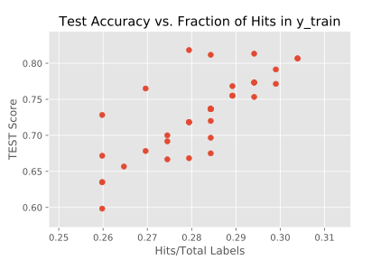

Next, I looked at the same plot, but with training accuracy.

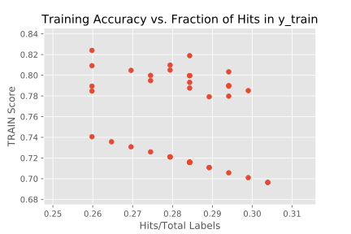

And test accuracy vs. training accuracy.

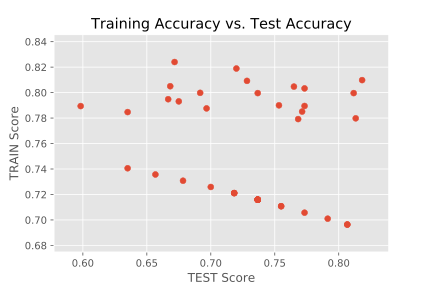

I saw that bizarre subset of points that draws a perfect line?? What is that? That has to be an
artifact of the algorithm right? I subsetted the dataset for where the training score < 0.76
to grab that unusual subset. I then plotted test score vs. ratio for just this subset. Sure enough.

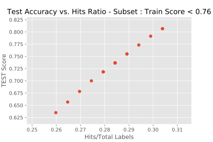

If you go back up to the first scatter plot, you can see that line in the noise. I looked at the
actual subsetted dataframe and noticed that this subset is perfectly the second half of the data.
In other words, this is the data where the vbounds range was more positive than negative. This
seems like too much of a coincidence.

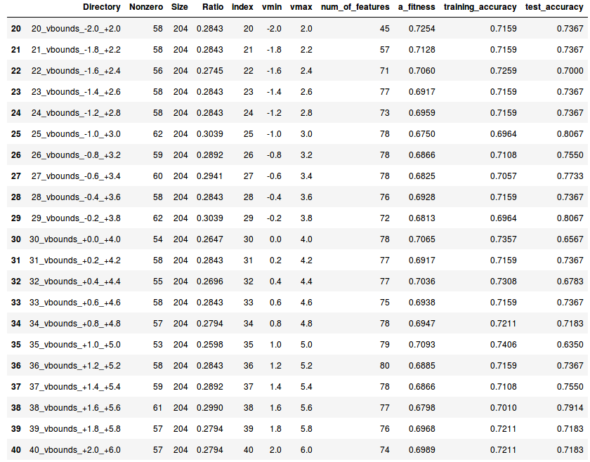

Comparison|Pearson Correlation
----------|-------------------
TEST Score vs. Ratio|0.7777
TRAIN Score vs. Ratio|-0.3304
TEST vs. TRAIN|-0.1796
SUBSET - TEST vs. Ratio|0.9985
SUBSET - TRAIN vs. Ratio|-0.9999
SUBSET - TEST vs. TRAIN|-0.9985
Inverse SUBSET - TEST vs. Ratio|0.6468
Inverse SUBSET - TRAIN vs. Ratio|-0.3912
Inverse SUBSET - TEST vs. TRAIN|-0.0515

As you can see, there is a perfect correlation between test score, training score, and the ratio
of hits in the training set when the vbounds center >= 0.0. There are smaller correlations
between the test or training scores and the ratio in the inverse subset, but the test - training
correlation is abolished. This leads me to think that test/training and ratio correlation was so
high in the subset that it created a false correlation between test and training scores. I repeated
this analysis for the [Tuning VBounds - Range](#0002) experiment cohorts where vbounds center ϵ 
{-2, 2}.

#### Tuning VBounds Range - Center = -2.0

Here, I essentially redid the analysis above on the cohort of [Tuning VBounds - Range](#0002) where
vcenter = -2.0. This dataset was about half as large.

Again, I first looked at Ratio vs. Test Score.

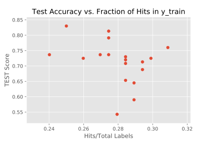

Then Ratio vs. Training Score

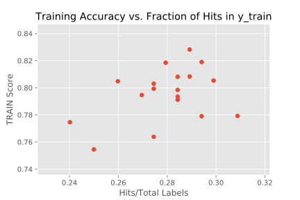

Curiously, I did not see anything obviously linear. However, when I decided to subset for
vcenter > 0.0, I realized that this dataset is guaranteed by design for vcenter = -2.0.
I compared test and training score, expecting to find nothhing, however this looked more
like what I saw early. I checked the Pearson correlation coefficients, however and the results
were not nothing.

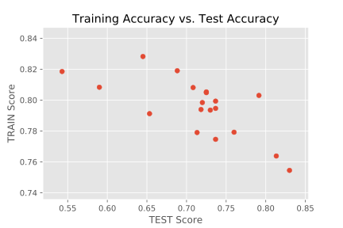

Comparison|Pearson Correlation
----------|-------------------
TEST Score vs. Ratio|-0.3205
TRAIN Score vs. Ratio|0.4016
TEST vs. TRAIN|-0.6958

#### Tuning VBounds Range - Center = +2.0

Again, I'm repeating the analysis with a different cohort. This one, I expect to see results
similar to Tuning VBounds because here, the center is guaranteed to be greater than 0.

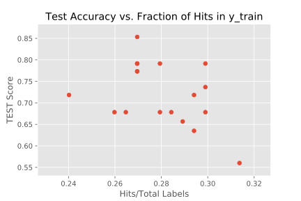

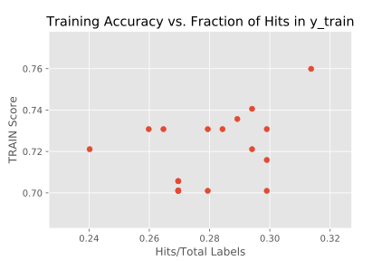

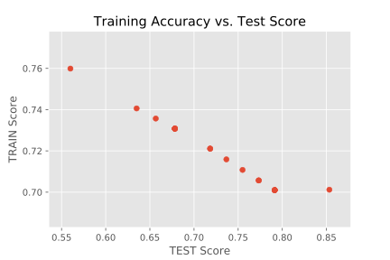

Comparison|Pearson Correlation
----------|-------------------
TEST Score vs. Ratio|-0.4036
TRAIN Score vs. Ratio|0.3930
TEST vs. TRAIN|-0.9812

Here, we have that same phenomenon, but slightly differently.

### Conclusions

Worryingly, all three datasets displayed a moderate to extremely strong negative Pearson
Correlation between test score and training score. This is a huge problem. It should be a positive
relationship so that a good training score indicates a decent or at least better test score.
This is such a strong relationship, I suspect there is a flaw in the approach. In the first
dataset, there was also a perfect correspondence with the ratio of hits/total labels. After some
looking through documentation, I discovered a keyword argument for the
`sklearn.model_selection.train_test_split ()` method called `stratify`. I should modify my
algorithm code to pass the target.csv array to the `stratify` argument whenever the data is split.

I confirmed that this argument behaves like I believe it to with a Python script that calls
`sklearn.model_selection.train_test_split()` 20 times on the data.csv and target.csv data
files, once with `stratify=None` and once with `stratify=np.loadtxt('target.csv')`.

I am unsure why this behavior was observed. I believe the reliance on ratio can be ablated
by calling the `stratify` argument. However, I am stuck on why there is such a strong negative
relationship between test\_score and training\_score. It was perfect when vcenter > 0, but
even in vcenter = -2.0, the correlation score was still -0.6958.

I went back and looked at the pair plot in [Tuning VBounds](#0001). I saw the same behavior
in training\_accuracy vs. test\_accuracy. I looked closer and realized that the subset of points
that display perfect linearity are the same subset where vcenter > 0.0. However, this is also
the same subset with a large number of selected features (top part of the sigmoid curve).
Unfortunately, although there is a relationship between vcenter and these points, there is no
discernible correlation between vcenter and the order in which these points came out. See vmin
vs. training\_accuracy in the same pair plot.

[Return to top](#0000)

----------------------------------------------------------------------------------------------------

## Mean Particle Velocity <a name="0003"></a>
June 26, 2018

### Question
Where do each particle's velocities fall in the v\_bounds parameter over time?

### Hypothesis
With input from Hassan, I hypothesize that each particle's velocity values tend towards the
extremes, min and max.

### Experiment Design
To test this, I will run the algorithm 3 times, each time with the same parameters, using
a parameter set that I have used in a previous experiment for consistency. At each time step,
an updated version of `COMB_Swarm` will record each particles mean velocity as a scalar into a
2D numpy array inside the `var_by_time` dictionary called `velocities`. Each row of the array
represents a time step, each column represents a particle.

Parameter|Value
:--------|-----
Number of Particles (npart)|100
Number of Features (ndim)|190
Acceleration Constants (c1, c2, c3)|2.1, 2.1, 2.1
Alpha (alpha)|0.8
Test Size (testsize)|0.2
X Bounds (x\_bounds)|(-6.0, 6.0)
V Bounds (v\_bounds)|(-4.0, 0.25)
W Bounds (w\_bounds|(0.4, 0.9)
Time (t\_bounds[1])|150

#### Input
Feature Data: data/data.csv

Target Data: data/target.csv

Feature Labels: data/feature\_labels.csv

#### Output
3 directories, named XX\_report\_velocities/ where XX is the iteration (XX ϵ \[00, 01, 02\]).
Each directory will have the following output files inside:

* abinary.csv
* cpso\_script.py
* error.txt
* output.txt
* job\_script
* pickled\_trained\_classifier
* summary\_results.out
* particle\_velocities.csv
* var\_by\_time.csv
* X\_train.csv
* y\_train.csv
* X\_test.csv
* y\_test.csv

pickled\_trained\_classifier and all \*.csv files are variable outputs at the end of the
algorithm. summary\_results.out is a comprehensive, auto-generated report. error.txt and
output.txt are stderr and stdout for the job. cpso\_script.py and job\_script are the
scripts used to run this experiment.

#### Running the Experiment

File List:

* cpso\_particle.py
* cpso\_swarm.py
* cpso.py
* experiment\_script.py

Directory List:

* analysis/
* data/

cpso\_particle.py and cpso\_swarm.py respectively hold COMB\_Particle and COMB\_Swarm classes
used by cpso.py to run an experiment. The actual experiment code is called by job\_script
for each iteration from within experiment\_script.py which generates and runs all jobs.

data/ holds the three data input files for the experiment. analysis/ holds anything processed
after the experiment was run: processed data, analysis notebooks, generated figures, etc.

This experiment was run with a series of dynamically created/called background jobs on Nathan
Fox's personal computer, named redgray, NIC MAC Address (AC:ED:5C:38:91:C2).

#### EXPERIMENT SCRIPT
```
import os
  
for i in range(3):
    filename = '{:02}_report_velocities'.format(i)
    os.system('mkdir {}'.format(filename))
    with open(filename+'/job_script', 'w') as f:
        f.write('#!/bin/bash\n')
        f.write('\n')
        f.write('function notifyme () {\n')
        f.write('\tstart=$(date +%s)\n')
        f.write('\t"$@"\n')
        f.write('\tnotify-send "I\'m Finished!" "\\"$(echo $@)\\" took $(($(date +%s) - start)) seconds to finish."\n')
        f.write('}\n')
        f.write('\n')
        f.write('notifyme python cpso.py --npart 100 --ndim 190 --constants 2.1 2.1 2.1 '
              + '--alpha 0.8 --testsize 0.2 --xbounds -6.0 6.0 '
              + '--vbounds -4.0 0.25 '
              + '--wbounds 0.4 0.9 --time 150 --data data/data.csv '
              + '--target data/target.csv --labels data/feature_labels.csv '
              + '--expname "Mean Particle Velocity - {:02}" '.format(i)
              + '--author "Nathan Fox" --outpath {}/ '.format(filename)
              + '\n')
    os.system('chmod +x {}/job_script'.format(filename))
    os.system('{}/job_script > {}/output.txt 2> {}/error.txt &'.format(filename, filename, filename))
```

### Results/Analysis
I plotted my results in a full graph, and then a time subset. The first graph is a progression of
all 100 particles over time. The y-axis shows the scalar mean of their continuous velocity
vectors at each time step. The second graph shows the same data, but only for t = 0 to t = 7.

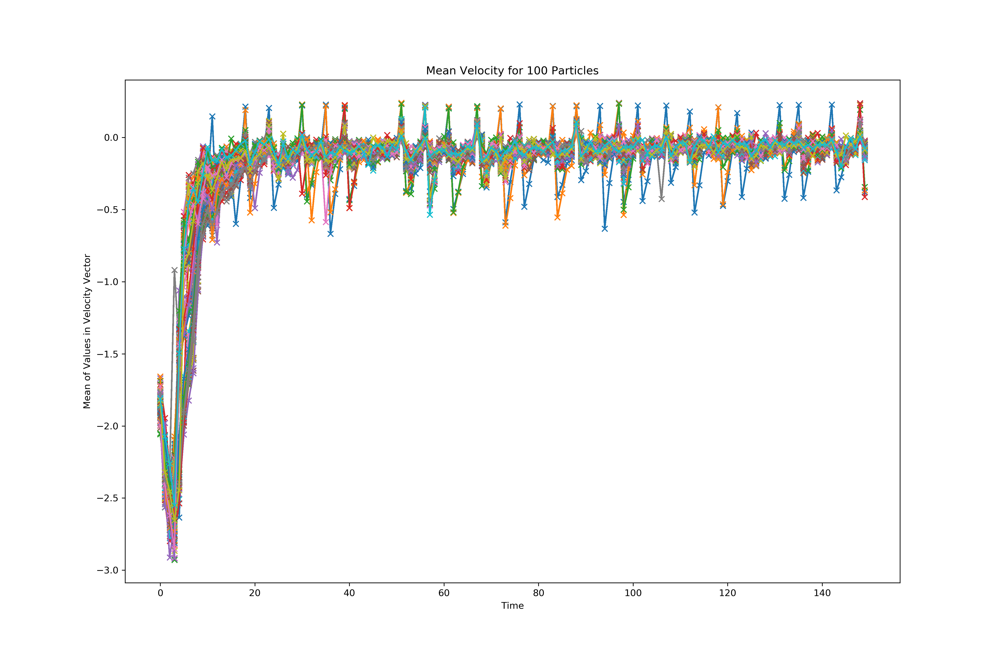


### Conclusions/Next Questions
I can clearly see that all 100 particles are exhibiting the same behavior. The problem is that
I didn't think clearly through my method. The mean of a vector doesn't tell me anything about
the spread. I'm interested in the frequency of extreme values, not the mean. So this data is
interesting, but worthless to answer my original question. I need to redo this experiment with
a different approach.

[Return to top](#0000)

----------------------------------------------------------------------------------------------------

## Mean Particle Velocity - The Sequel <a name="0004"></a>
June 26, 2018

### Question
Where do each particle's velocities fall in the v\_bounds parameter over time?

### Hypothesis
With input from Hassan, I hypothesize that each particle's velocity values tend towards the
extremes, min and max.

### Experiment Design
To test this, I will run the algorithm 3 times, each time with the same parameters, using
a parameter set that I have used in a previous experiment for consistency. At each time step,
for each particle, an updated version of COMB\_Swarm will calculate the percentage of the
velocity vector that is at an "extreme" (> 90th percentile or < 10th percentile) as a scalar
between 0.0 and 1.0 and store it in a 2D numpy array inside the `var_by_time` dictionary called
`velocities`. Each row of the array represents a time step, each column represents a particle.

Parameter|Value
:--------|-----
Number of Particles (npart)|100
Number of Features (ndim)|190
Acceleration Constants (c1, c2, c3)|2.1, 2.1, 2.1
Alpha (alpha)|0.8
Test Size (testsize)|0.2
X Bounds (x\_bounds)|(-6.0, 6.0)
V Bounds (v\_bounds)|(-4.0, 0.25)
W Bounds (w\_bounds|(0.4, 0.9)
Time (t\_bounds[1])|150

#### Input
Feature Data: data/data.csv

Target Data: data/target.csv

Feature Labels: data/feature\_labels.csv

#### Output
3 directories, named XX\_report\_velocities/ where XX is the iteration (XX ϵ \[00, 01, 02\]).
Each directory will have the following output files inside:

* abinary.csv
* cpso\_script.py
* error.txt
* output.txt
* job\_script
* pickled\_trained\_classifier
* summary\_results.out
* var\_by\_time.csv
* particle\_velocities.csv
* X\_train.csv
* y\_train.csv
* X\_test.csv
* y\_test.csv

pickled\_trained\_classifier and all \*.csv files are variable outputs at the end of the
algorithm. summary\_results.out is a comprehensive, auto-generated report. error.txt and
output.txt are stderr and stdout for the job. cpso\_script.py and job\_script are the
scripts used to run this experiment.

#### Running the Experiment

File List:

* cpso\_particle.py
* cpso\_swarm.py
* cpso.py
* experiment\_script.py

Directory List:

* analysis/
* data/

cpso\_particle.py and cpso\_swarm.py respectively hold COMB\_Particle and COMB\_Swarm classes
used by cpso.py to run an experiment. The actual experiment code is called by job\_script
for each iteration from within experiment\_script.py which generates and runs all jobs.

data/ holds the three data input files for the experiment. analysis/ holds anything processed
after the experiment was run: processed data, analysis notebooks, generated figures, etc.

This experiment was run with a series of dynamically created/called background jobs on Nathan
Fox's personal computer, named redgray, NIC MAC Address (AC:ED:5C:38:91:C2).

#### EXPERIMENT SCRIPT
```
import os
  
for i in range(3):
    filename = '{:02}_report_velocities'.format(i)
    os.system('mkdir {}'.format(filename))
    with open(filename+'/job_script', 'w') as f:
        f.write('#!/bin/bash\n')
        f.write('\n')
        f.write('function notifyme () {\n')
        f.write('\tstart=$(date +%s)\n')
        f.write('\t"$@"\n')
        f.write('\tnotify-send "I\'m Finished!" "\\"$(echo $@)\\" took $(($(date +%s) - start)) seconds to finish."\n')
        f.write('\tpaplay ~/.local/sndfiles/ding_ding.wav\n')	
        f.write('}\n')
        f.write('\n')
        f.write('notifyme python cpso.py --npart 100 --ndim 190 --constants 2.1 2.1 2.1 '
              + '--alpha 0.8 --testsize 0.2 --xbounds -6.0 6.0 '
              + '--vbounds -4.0 0.25 '
              + '--wbounds 0.4 0.9 --time 150 --data data/data.csv '
              + '--target data/target.csv --labels data/feature_labels.csv '
              + '--expname "Mean Particle Velocity - {:02}" '.format(i)
              + '--author "Nathan Fox" --outpath {}/ '.format(filename)
              + '\n')
    os.system('chmod +x {}/job_script'.format(filename))
    os.system('{}/job_script > {}/output.txt 2> {}/error.txt &'.format(filename, filename, filename))
```

### Results/Analysis
First, I plotted all 100 particles for "Velocity Extremeness" over time, to get a sense of the
variance in behavior. Are they all doing the same thing? Any clustering? Outliers? This of course
produced an unreadable graph, but that was the point.

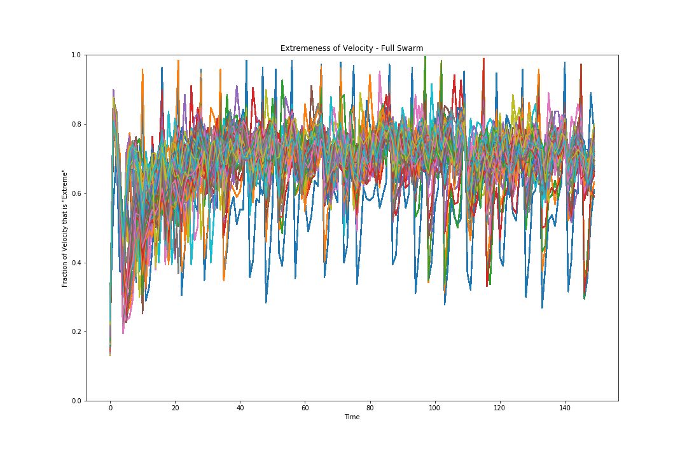

Next, I plotted the same data, but for the first 3 particles. Because each particle's initial
position/velocity is random, it was unnecessary to choose a random sample.

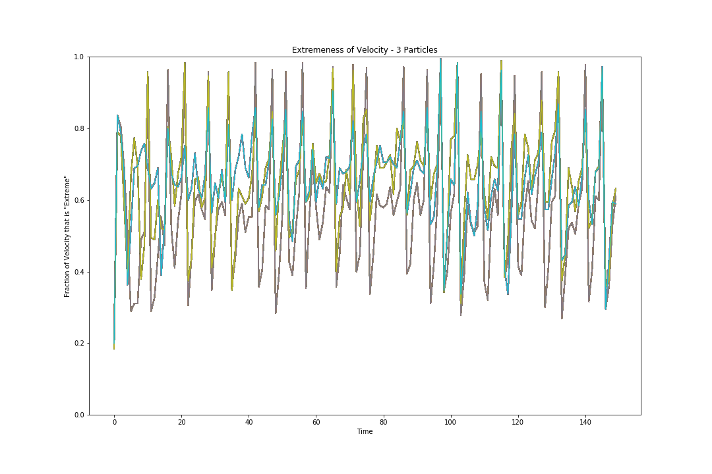

This was still hard to read, so I also plotted the path of just one particle.

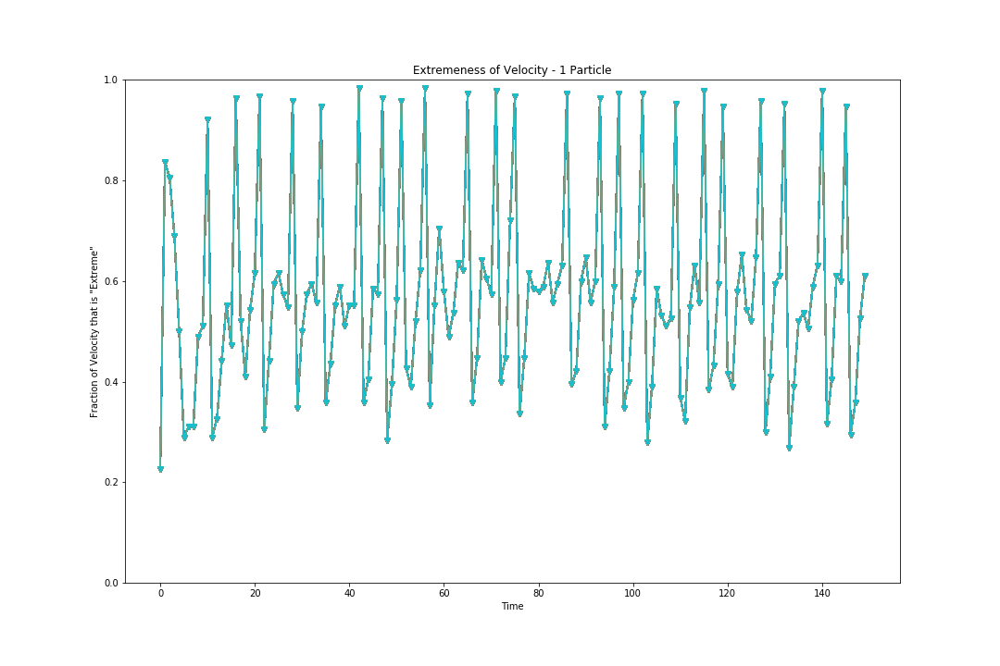

### Conclusions/Next Questions
From these plots, it's apparent that the normal behavior for a particle under these conditions
is to drastically swing back and forth between an extreme velocity and a relatively moderate
velocity. However, after the first 10 time steps, no particle ever dropped below 0.2. This means
that every particle always had at least 20% of its features in an extreme velocity state. I
think that this is not ideal and that the particles should display more moderate velocity,
especially considering that they are trying to converge, not blindly run around.

This raises two possibilities:

1. The swarm is failing to converge.
2. The swarm is unable to converge.

If the 1st possibility is the answer, then the other variables by time should be examined.
It may be that 150 was too short for the swarm to find an optimum. However, it may also be that
there are many equivalent optima and the swarm is failing to converge, yet failing to improve.

If the second possibility is the answer, there is a major problem in my parameters and the
particles are failing to slow down.

I ran a quick analysis of the time-varying variables for the 00 iteration and am satified that
the swarm is finding a stable optimum, however, I'm unsure if they're converging. I realize that
this report can only show me if the swarm if failing to find a better location, not if they
are actually converging. Perhaps I can ask Hassan. Is there a way to calculate "spread" of a
swarm? Perhaps calculating the center of the swarm and sum distance from center?

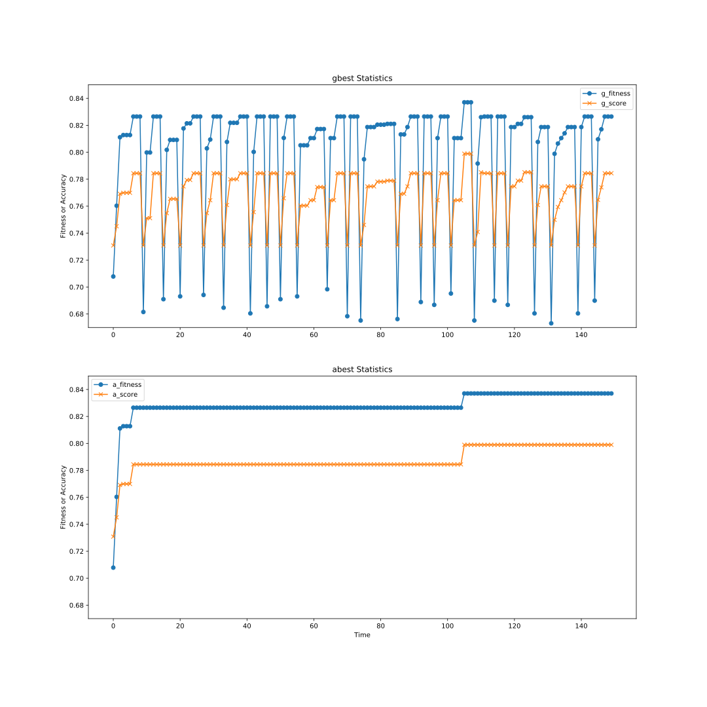


[Return to top](#0000)

----------------------------------------------------------------------------------------------------

## Swarm Convergence <a name="0005"></a>
June 27, 2018

### Question
Is the swarm actually converging on a target, or is it merely flailing and failing to find a
better position?

### Hypothesis
I suspect that the swarm is continuing to travel wildly instead of slowing and converging as a
group to an optimum location.

### Experiment Design
I will repeat a set of previous parameters to increase the likelihood that I can interpret my
results. I will introduce a new method in CPSO\_Swarm to calculate and store the "spread"
of the swarm in its current state. I will report the spread, both as a sum of distances
and as the mean particle distance. The new function is copied below:

```
def calc_spread(self, mean=False):
    """Return the "spreadness" of the swarm.

    Calculates the distance that each particle in the swarm is from
    the center position of the swarm and returns the sum.

    The center position is calculated by taking the mean of all particle
    positions, then the distance from the center is calculated for each
    particle and the sum is returned.

    Parameters
    ----------
    mean : boolean; if true, returns the mean of the distances, if false,
           returns the sum of the distances.

    Returns
    -------
    spread : float; sum or mean of all distances between particles and
             the center of the swarm.

    Raises
    ------
    None
    """
    positions = []
    for p in self.swarm:
        positions.append(p.x)
    positions = np.array(positions)
    center = np.mean(positions, axis=0)
    if mean:
        return np.linalg.norm(positions - center, axis=1).mean()
    else:
        return np.linalg.norm(positions - center, axis=1).sum()
```

I tested this new method in a separate script called test\_calc\_spread.py, located
in the experiment folder.

Similarly to [Mean Particle Velocity - The Sequel](#0004), I will run this in triplicate.

Parameter|Value
:--------|-----
Number of Particles (npart)|100
Number of Features (ndim)|190
Acceleration Constants (c1, c2, c3)|2.1, 2.1, 2.1
Alpha (alpha)|0.8
Test Size (testsize)|0.2
X Bounds (x\_bounds)|(-6.0, 6.0)
V Bounds (v\_bounds)|(-4.0, 0.25)
W Bounds (w\_bounds|(0.4, 0.9)
Time (t\_bounds[1])|150

#### Input
Feature Data: data/data.csv

Target Data: data/target.csv

Feature Labels: data/feature\_labels.csv

#### Output
3 directories, named XX\_report\_spread/ where XX is the iteration (XX ϵ \[00, 01, 02\]).
Each directory will have the following output files inside:

* abinary.csv
* cpso\_script.py
* error.txt
* output.txt
* job\_script
* pickled\_trained\_classifier
* summary\_results.out
* var\_by\_time.csv
* X\_train.csv
* y\_train.csv
* X\_test.csv
* y\_test.csv

pickled\_trained\_classifier and all \*.csv files are variable outputs at the end of the
algorithm. summary\_results.out is a comprehensive, auto-generated report. error.txt and
output.txt are stderr and stdout for the job. cpso\_script.py and job\_script are the
scripts used to run this experiment.

#### Running the Experiment

File List:

* cpso\_particle.py
* cpso\_swarm.py
* cpso.py
* experiment\_script.py

Directory List:

* analysis/
* data/

cpso\_particle.py and cpso\_swarm.py respectively hold COMB\_Particle and COMB\_Swarm classes
used by cpso.py to run an experiment. The actual experiment code is called by job\_script
for each iteration from within experiment\_script.py which generates and runs all jobs.

data/ holds the three data input files for the experiment. analysis/ holds anything processed
after the experiment was run: processed data, analysis notebooks, generated figures, etc.

This experiment was run with a series of dynamically created/called background jobs on Nathan
Fox's personal computer, named redgray, NIC MAC Address (AC:ED:5C:38:91:C2).

#### EXPERIMENT SCRIPT
```
import os

for i in range(3):
    filename = '{:02}_report_spread'.format(i)
    os.system('mkdir {}'.format(filename))
    with open(filename+'/job_script', 'w') as f:
        f.write('#!/bin/bash\n')
        f.write('\n')
        f.write('function notifyme () {\n')
        f.write('\tstart=$(date +%s)\n')
        f.write('\t"$@"\n')
        f.write('\tpaplay ~/.local/sndfiles/ding_ding.wav\n')
        f.write('\tnotify-send "I\'m Finished!" "\\"$(echo $@)\\" took $(($(date +%s) - start)) seconds to finish."\n')
        f.write('}\n')
        f.write('\n')
        f.write('notifyme python cpso.py --npart 100 --ndim 190 --constants 2.1 2.1 2.1 '
              + '--alpha 0.8 --testsize 0.2 --xbounds -6.0 6.0 '
              + '--vbounds -4.0 0.25 '
              + '--wbounds 0.4 0.9 --time 150 --data data/data.csv '
              + '--target data/target.csv --labels data/feature_labels.csv '
              + '--expname "Swarm Convergence - {:02}" '.format(i)
              + '--author "Nathan Fox" --outpath {}/ '.format(filename)
              + '\n')
    os.system('chmod +x {}/job_script'.format(filename))
    os.system('{}/job_script > {}/output.txt 2> {}/error.txt &'.format(filename, filename, filename))
```

### Results/Analysis
I plotted both the Sum of Particle Distances from the Center for the swarm at each time point
and the Mean Particle Distance for the swarm at each time point.

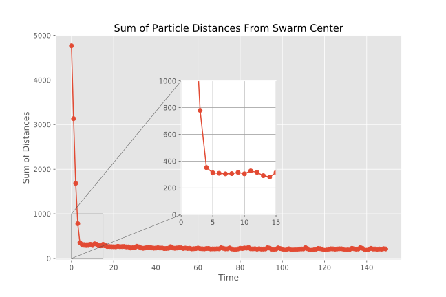

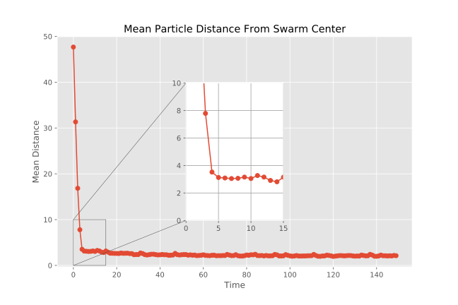

### Conclusions/Next Questions

I think this is satisfactory evidence that the swarm is converging extremely quickly to
a local optimum. I'm curious if the swarm is capable of jumping to a better area. Either way,
I'm satisfied that I refuted my hypothesis and the swarm is definitely converging.

[Return to top](#0000)

----------------------------------------------------------------------------------------------------

## Verifying Rational Polypharmacology <a name="0006"></a>
July 3, 2018

### Question
Can I replicate the accuracy, sensitivity, and specificity reported in "Rational Polypharmacology"
by training my default SVM on the kinases reported in the paper?

### Hypothesis
I hypothesize that my results will not be as good as the values reported in the paper, but should
be better than the values I've been seeing on my less refined method. This is because I don't
know the parameters that were used for the SVM used in the paper.

### Experiment Design
I will write a custom script that trains a default SVM from sklearn on 10-15 kinases, then
test. I will try single train/test instances and 10-Fold Cross Validations on several different
combinations of kinases.

Source Paper: doi: 10.1021/acschembio.5b00289

The following are the 15 polypharmacologically linked groups identified by the authors
of the Rational Polypharmacology paper.

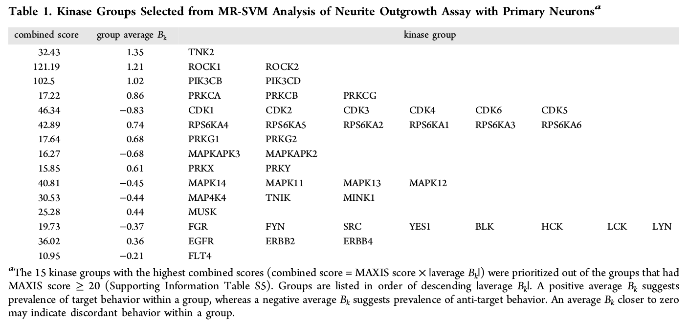

#### Training Subset Cohorts

**Cohort 1:** Kinases from Figure 3a (Representatives)

* ROCK2
* PIK3CD
* PRKCG
* PRKG1
* PRKX
* TNK2
* RPS6KA4
* CDK5
* MAPKAPK3
* MAPK14

**Cohort 2:** First Kinase in Each Group

* TNK2
* ROCK1
* PIK3CB
* PRKCA
* CDK1
* RPS6KA4
* PRKG1
* MAPKAPK3
* PRKX
* MAPK14
* MAP4K4
* MUSK
* FGR
* EGFR
* FLT4

**Cohort 3:** Random Selections (replicate 3 times)
Randomly selected member from each group.

To summarize, I will try 2 versions:

1. Random Stratified Train/Test Split, Fit, then Test.
2. 10-Fold Stratified Cross Validation

For each version, I will test 5 cohorts:

1. Cohort 1: Kinases from Figure 3a.
2. Cohort 2: First Kinase from 15 groups.
3. Cohort 3: Stratified Random Selection.
4. Cohort 3: Stratified Random Selection.
5. Cohort 3: Stratified Random Selection.

NOTE: Cohort 3 is repeated thrice because it is a random selection.

I will then compare accuracy, sensitivity, and specificity for all iterations.

This process will be repeated for an SVM using a different kernel each time:
{'linear', 'rbf', 'poly', 'sigmoid', 'precomputed'}.

#### Output

#### Running the Experiment

File List:

Directory List:

#### EXPERIMENT SCRIPT
```
```

### Results/Analysis

### Conclusions/Next Questions

[Return to top](#0000)

----------------------------------------------------------------------------------------------------
## TITLE <a name="0007"></a>
DATE

### Question

### Hypothesis

### Experiment Design


Parameter|Value
:--------|-----

#### Input

#### Output

#### Running the Experiment

File List:

Directory List:

#### EXPERIMENT SCRIPT
```
```

### Results/Analysis

### Conclusions/Next Questions

[Return to top](#0000)

----------------------------------------------------------------------------------------------------

